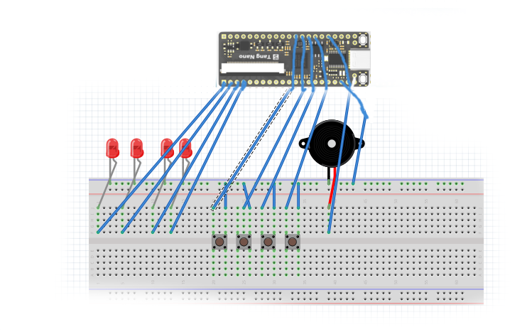

# simpleTD4 
simpleTD4 is an implementation of 4bit CPU TD4 written with verilog.
simpleTD4 runs on iverlog or [Sipeed Tang Nano] (https://tangnano.sipeed.com/en/) .

## license
  ```
Copyright (c) 2020 asfdrwe <asfdrwe@gmail.com>

Permission is hereby granted, free of charge, to any person obtaining a copy 
of this software and associated documentation files (the "Software"), to deal 
in the Software without restriction, including without limitation the rights 
to use, copy, modify, merge, publish, distribute, sublicense, and/or sell 
copies of the Software, and to permit persons to whom the Software is 
furnished to do so, subject to the following conditions:

The above copyright notice and this permission notice shall be included in 
all copies or substantial portions of the Software.

THE SOFTWARE IS PROVIDED "AS IS", WITHOUT WARRANTY OF ANY KIND, EXPRESS OR 
IMPLIED, INCLUDING BUT NOT LIMITED TO THE WARRANTIES OF MERCHANTABILITY, 
FITNESS FOR A PARTICULAR PURPOSE AND NONINFRINGEMENT. IN NO EVENT SHALL 
THE AUTHORS OR COPYRIGHT HOLDERS BE LIABLE FOR ANY CLAIM, DAMAGES OR OTHER 
LIABILITY, WHETHER IN AN ACTION OF CONTRACT, TORT OR OTHERWISE, ARISING FROM, 
OUT OF OR IN CONNECTION WITH THE SOFTWARE OR THE USE OR OTHER DEALINGS 
IN THE SOFTWARE.
  ```

## requires
- [iverlog](http://iverilog.icarus.com/)
	- [Windows Version](http://bleyer.org/icarus/)
- [gtkwave](http://gtkwave.sourceforge.net/) (optional)

- [Sipeed Tang Nano] (https://tangnano.sipeed.com/en/) (optional)  
low price FPGA board


## for iverilog
simpleTD4 is tested only on linux.

### compile
   ```
iverlog -o TD4 TD4.v TD4_test.v
   ```

### run
   ```
./TD4
   ```

### signal check
   ```
gtkwave TD4.vcd
   ```

## for Tang Nano
run gw_ide and open nano\_simple/TD4\_nano1.gprj or nano\_breadboard/TD4\_nano1.gprj or nano\_uart/TD4\_nano.gprj and build

## TD4 details
TD4 is 4bit CPU designed in ["CPU no tsukurikata (How to create CPU)" by Watanabe, Kaoru](https://www.amazon.co.jp/dp/4839909865/) (written in Japanese).

The unofficial details of TD4 on web is [CPU no tsukurikata TD4 by Yamamoto, Minoru](http://xyama.sakura.ne.jp/hp/4bitCPU_TD4.html) (written in Japanese). The example circuite design is [HERE](http://xyama.sakura.ne.jp/4bitCPU_TD4/4bitCPU_TD4x.gif).

simpleTD4's diagram:  


### TD4 specification
- register (4bit)
	- AREG
	- BREG
	- OUTREG
	- PCREG  
	PC+1 by 1cycle normally
- flag  
carry(1bit)
- Arithmetic Logical Unit(ALU)  
4bit + 4bit add unit only
- instruction memory  
16bytes
- input/output
	- 4bit input port
	- 4bit output port (values from OUTREG)
- instruction set  
fixed width(8bit)  
upper 4bits are opcode and lower 4bits are immediate value.

- instruction list  
(A => AREG, B => BREG, OUT => OUTREG, PC => PCREG, IN => input port, IM => immediate value)

| opcode | mnemonic | meaning |
|----|----|----|
| 0000 | ADD A, Im | A + Im => A       	|
| 0001 | MOV A, B  | B => A             |
| 0010 | IN A      | IN => A		|
| 0011 | MOV A, Im | Im => A            |
| 0100 | MOV B, A  | A => B             |
| 0101 | ADD B, Im | B + Im => B        |
| 0110 | IN B      | IN => B	 	|
| 0111 | MOV B, Im | Im => B     	|
| 1001 | OUT B     | B => OUT     	|
| 1011 | OUT Im    | Im => OUT		|
| 1110 | JNC Im    | Im => PC if carry	|
| 1111 | JMP Im    | Im => PC           |


## files
- TD4.v  
main verilog code
- TD4_test.v  
testbench for TD4.v

- ROM.bin  
simpleTD4 loads ROM.bin as main program.
Please rename ROMLED.bin or ROMRAMEM.bin or ROMINOUT.bin or your code to ROM.bin.
- ROMLED.bin  
output 0011, 0110, 1100, 1000, 1000, 1100, 0110, 0011, 0001 and loop 
- ROMRAMEM.bin  
3 minutes timer 
- ROMINOUT.bin  
read input data to BREG and write BREG to OUT and loop

- README.md  
this document

- TD4withComment.v  
the commented simpleTD4 implementation

- *\_jp.md  
the Japanse version document and the details of simpleTD4 implemetation written in Japanese

- nano\_simple  
run on Tang Nano simply

- nano\_breadboard  
run with breadboard   


- nano\_uart  
output TD4 log to PC   
log format:  
pc opcode reg\_a,reg\_b,reg\_out,reg\_in cflag|load\_a,load\_b,load\_out,load\_pc|nextcflag|alu\_out

## How to write ROM.bin
write 8bits in 1 line  
ignore \_ , // as comment for iverilog   
see ROMLED.bin ROMRAMEM.bin ROMINOUT.bin  
