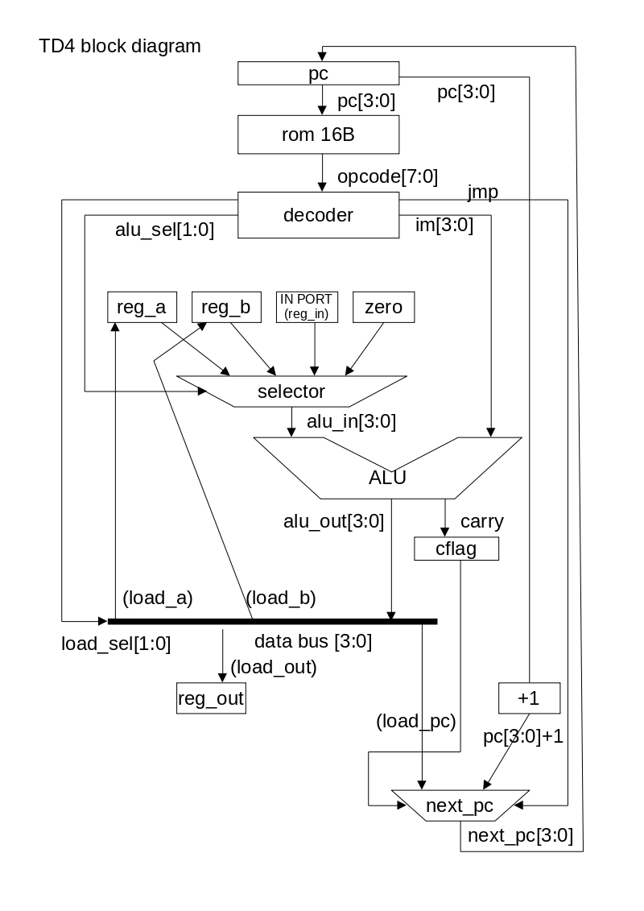

# simpleTD4実装の解説

## はじめに
 TD4は『CPUの創りかた』(渡波 郁)で設計解説されたとてもシンプルな4bitのCPU
です。『CPUの創りかた』ではICで実装していますが、TD4をVerilogによる60行
程度の1ファイルで実装しています。

 『作ろう! CPU』(上原 周)という書籍でもSystem VerilogでTD4を実装している
ようなのでそちらと比較してみてもいいと思います。そちらは69行だそうですが
こちらは60行なので少しだけ短いです。

 なお、iverilogはSystem Verilogへの対応が2020/9/19時点では不十分なので
iverilogで動作確認するときは気をつけてください。

### 前提知識
 論理回路、組み合わせ回路、順序回路、Verilog HDLなど

参考ページ:  
- 論理回路、組み合わせ回路、順序回路
	- [井澤氏の論理回路の解説1](http://www7b.biglobe.ne.jp/~yizawa/logic/index.html)
	- [井澤氏の論理回路の解説2](http://www7b.biglobe.ne.jp/~yizawa/logic2/index.html)
- Verilog
	- [新居氏のVerilog解説](http://cas.eedept.kobe-u.ac.jp/~arai/Verilog/index.html)
	- [リコンフィギュラブルコンピューティングシステム研究室のVerilog解説](http://www.darwin.esys.tsukuba.ac.jp/home/ohyou/verilog)

## TD4の仕様
- レジスタ(4bit)
	- Aレジスタ
	- Bレジスタ
	- OUTレジスタ
	- プログラムカウンタ(PC)  
		プログラムカウンタは1サイクルごとに通常+1されます。
- フラグレジスタ  
キャリーフラグ(1bit)
- 算術論理演算装置(ALU)  
4bit+4bitの加算演算のみ
- 命令メモリ  
16バイト
- 入出力
	- 4bit入力ポート
	- 4bit出力ポート(OUTレジスタ接続)

- 命令セット  
8bit固定長  
上位4bitが命令、下位4bitが即値

- 命令一覧  
(A => Aレジスタ、B => Bレジスタ、OUT => OUTレジスタ、PC => プログラムカウンタ、
IN => 入力ポート、 IM => 即値)  

| 命令 | ニモニック | 意味 |
----|---------|----
| 0000 | ADD A, Im | A + 即値(Im)をAに代入 (A + Im => A) 		|
| 0001 | MOV A, B  | BをAに代入(B + 0000 => A) 			|
| 0010 | IN A      | 入力ポートの値をAに代入(IN + 0000 => A)	|
| 0011 | MOV A, Im | 即値(Im)の値をAに代入(Im + 0000 => A)		|
| 0100 | MOV B, A  | AをBに代入 (A + 0000 => B)			|
| 0101 | ADD B, Im | B + 即値(Im)をBに代入 (B + Im => B)		|
| 0110 | IN B      | 入力ポートの値をBに代入 (IN + 0000 => B)	|
| 0111 | MOV B, Im | 即値(Im)の値をBに代入 (Im + 0000 => B)	|
| 1001 | OUT B     | BをOUTレジスタに代入 (B + 0000 => OUT)	|
| 1011 | OUT Im    | 即値(im)をOUTレジスタに代入 (Im + 0000 => OUT)|
| 1110 | JNC Im    | キャリーフラグが立っていないならImにジャンプ (Im + 0000 => PC if carry)|
| 1111 | JMP Im    | Imにジャンプ (Im + 0000 => PC)		|

## simpleTD4の実装の詳細
構成要素  
- レジスタとフラグ
	- reg_a
	- reg_b
	- reg_out
	- pc
	- cflag
- ALU  
加算演算
- セレクタ
	- alu_sel(ALU入力用)
	- next_pc(次のPC用)
- バス  
レジスタ用バス(load_selで出力先選択)
- 入出力
	- in_port(入力用)
	- out_port(出力用)

## ブロックダイアグラム
[やまもと氏の電子工作作品集](http://xyama.sakura.ne.jp/hp/4bitCPU_TD4.html)
を参考に次のブロックダイアグラムを作りました。

これに従って実装しています。

### 実装の詳細
 一般的なCPUと同様な順番で処理されます。1クロックの間に、命令読み出し(Fetch)、解読(Decode)、演算(Execute)、レジスタへの書き出し(Write Back)、次のPC書き出し(Next PC)のステージ順に実行します。

#### 各要素の入力と出力
- Fetch  
入力: pc  
出力: opcode  
- Decode  
入力: opcode  
出力: alu\_sel, load\_sel, jmp, im  
- Execute  
入力: reg\_a, reg\_b, in\_port, 4'b0000, alu\_sel  
出力: alu\_out, nextcflag  
- Write Back  
入力: alu\_out, load\_sel  
出力：reg\_a, reg\_b, reg\_out  
- Next PC  
入力: load\_sel, jmp, cflag, pc, alu\_out
出力: next\_pc

#### 実装
[TD4のソース](TD4.v)

 命令メモリは10~11行目で定義されています。ROM.binに1行ごとに8bitの2進数で
記述します。

 Fetchは13~15行目で、現在のpcのアドレスにある命令をromから取り出し、
opcodeに出力します。

 Decodeは17~23行目で、即値(im)はopcode[3:0]、ALUへの入力を選択するalu\_selが
JNCやJMPのときは2'b11でそうでないときはopcode[5:4]、出力レジスタを選択する
load\_selがopcode[7:6]、JMP命令かどうかを示すjmpがopcode[4]です。

 Executeは25\~34行目で、25\~29行目でalu\_selに基づきreg\_a(2'b00)かreg\_b
(2'b01)かin\_port(2'b10)か0入力(2'b11)を決定し、33行目でalu\_selの
選択した値とimを加算し、alu\_outとnextcflagに出力します。

 Write Backは36\~39行目でload\_selからデータバスの出力先を決定します。
53\~56行目でクロックごとにreg\_a、reg\_b、reg\_out、cflagを設定しています。

 Next PCは40~43行目でload\_selからジャンプ命令であるか調べ、無条件
ジャンプまたはキャリーフラグが立っていない(負論理)なら次のpcを選択する
load\_pcを決め、43行目でジャンプ命令ならalu\_out、そうでないならpc+1を
次のpc(next\_pc)にします。57行目でクロックごとにpcの値を設定しています。

 最後に、45~51行目でリセットが押されていればreg\_a、reg\_b、reg\_out、
cflag、pcを初期化しています。
